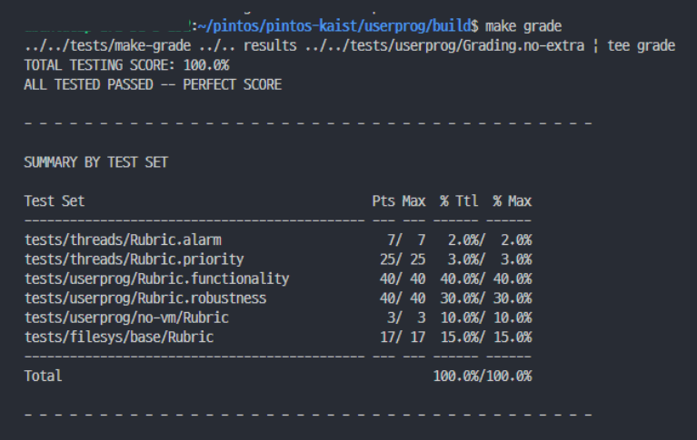
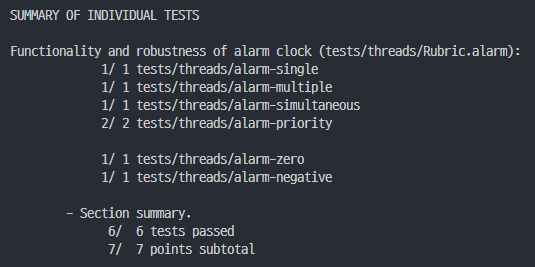
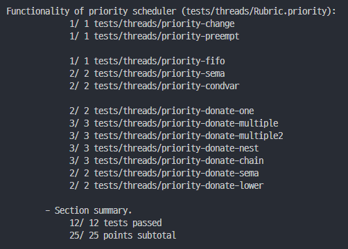
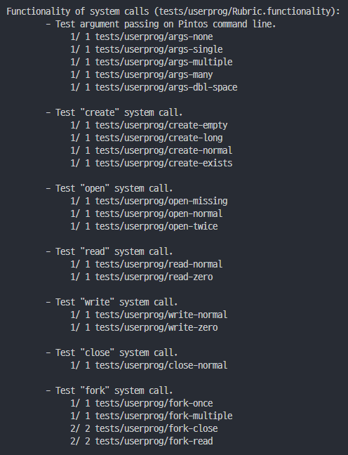
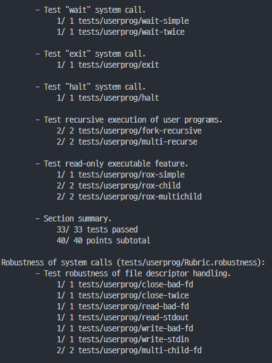
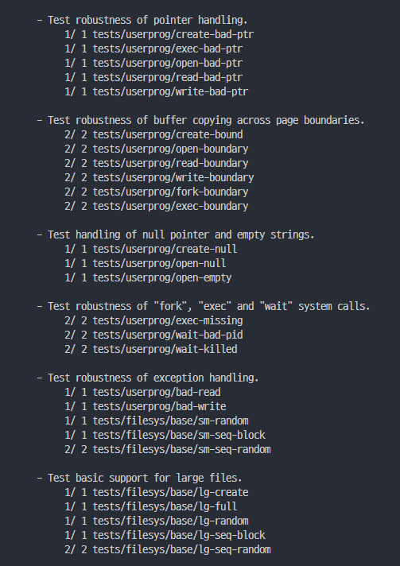
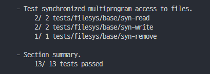

Brand new pintos for Operating Systems and Lab (CS330), KAIST, by Youngjin Kwon.

The manual is available at https://casys-kaist.github.io/pintos-kaist/.

# PROJECT2

- Topic : User Program
- Commencement : 06/02
- Dued : 06/11

# RESULTS

# IMPLEMENTATION REFERENCES

- [kaist gitbook](https://casys-kaist.github.io/pintos-kaist/)
- [stanford uni class slides](https://web.stanford.edu/class/cs140/projects/pintos/pintos_3.html#SEC32)
